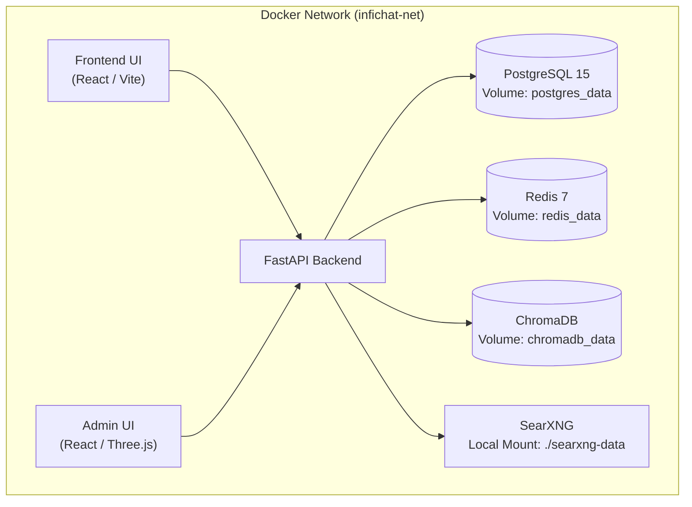
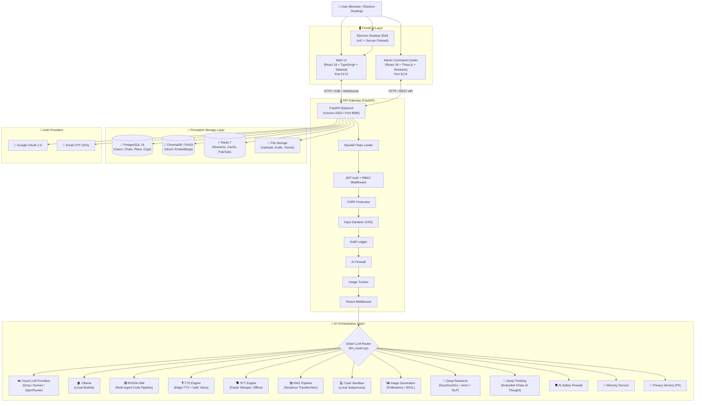
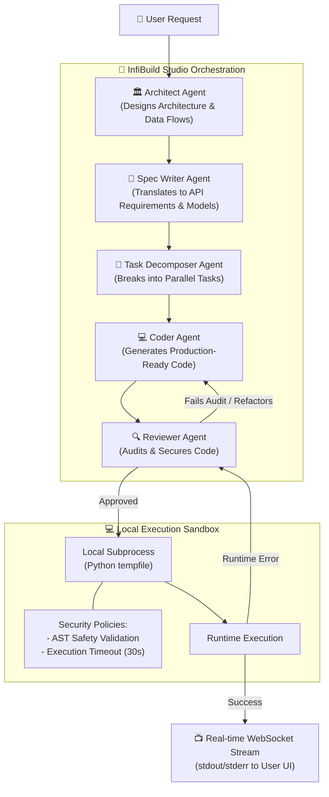
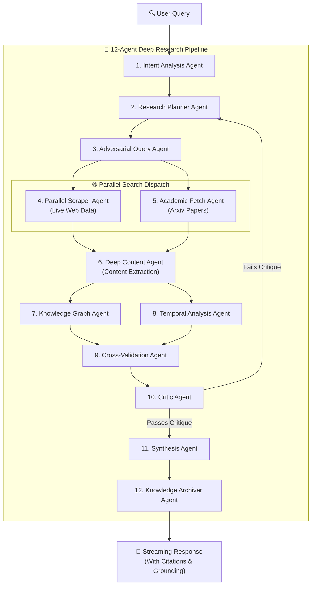
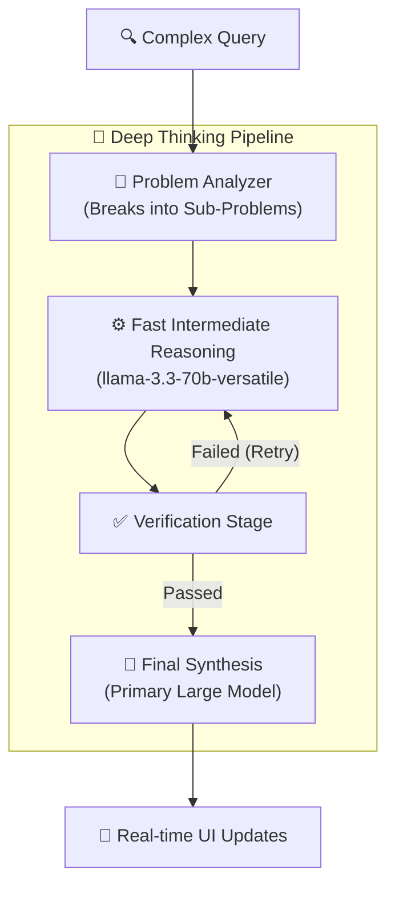
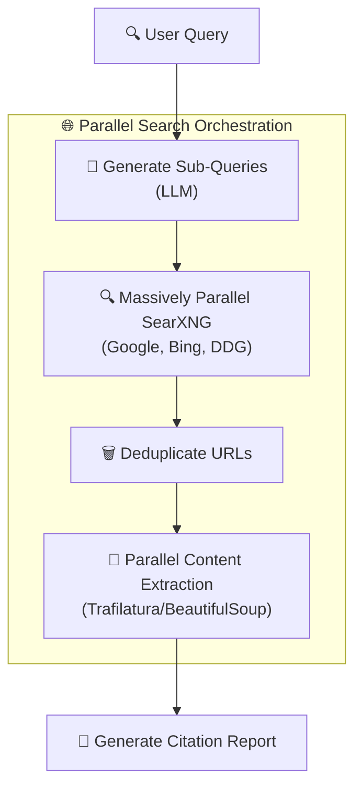
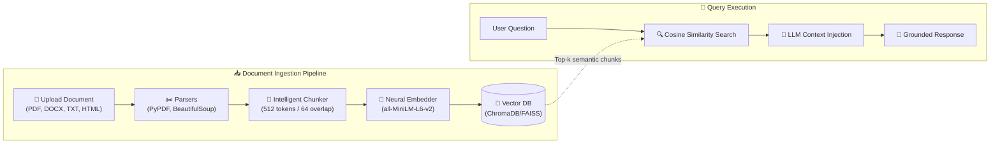
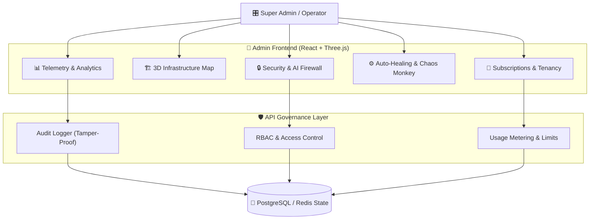

# 🏗️ InfiChat System Architecture

This document contains the deep technical architecture, module references, and component blueprints for InfiChat and its advanced AI engines.

---

## 🐳 Docker Orchestration (Production Infrastructure)

InfiChat uses Docker Compose to orchestrate its 7-container production microservices architecture. All persistent state is maintained in isolated volumes to guarantee zero data leakage.



## High-Level Architecture Diagram



## Request Lifecycle — Chat Message Flow

```
┌──────────────────────────────────────────────────────────────────────────┐
│                        CHAT REQUEST LIFECYCLE                            │
├──────────────────────────────────────────────────────────────────────────┤
│                                                                          │
│  1. User types message in React UI                                       │
│     │                                                                    │
│  2. React sends POST /api/chat/stream with JWT token                     │
│     │                                                                    │
│  3. FastAPI middleware pipeline:                                         │
│     │  Rate Limit → JWT Verify → CSRF Check → Input Sanitize             │
│     │  → Audit Log → AI Firewall → Usage Track → Tenant Isolate          │
│     │                                                                    │
│  4. Smart Router determines task type:                                   │
│     │                                                                    │
│     ├── 🔬 Deep Research?                                                │
│     │   └→ Orchestrates 12-agent pipeline → stream results               │
│     │                                                                    │
│     ├── 🤔 Deep Thinking?                                                │
│     │   └→ Extended chain-of-thought → stream thinking steps             │
│     │                                                                    │
│     ├── 📚 RAG enabled?                                                  │
│     │   └→ ChromaDB/FAISS similarity search → inject context             │
│     │                                                                    │
│     ├── 💻 Code task?                                                    │
│     │   └→ Multi-Agent Orchestrator → Local Sandbox → stream output      │
│     │                                                                    │
│     └── 💬 Standard chat?                                                │
│         └→ Smart Router → stream SSE tokens from Groq/Gemini/OpenRouter  │
│                                                                          │
│  5. React renders tokens in real-time (useChatStream.ts)                 │
│                                                                          │
│  6. PostgreSQL persists conversation + Redis caches session state        │
│                                                                          │
└──────────────────────────────────────────────────────────────────────────┘
```

## 🤖 InfiBuild Studio (5-Agent Code Generation Pipeline)

InfiBuild Studio is a production-grade multi-agent coding orchestrator. Instead of a single model trying to write all code, it breaks down the software development lifecycle into distinct agents:



## 🔬 Deep Research Engine (12-Agent Pipeline)

The Deep Research Engine is a massive 12-stage pipeline that simulates an entire research team working in parallel to fetch, analyze, and synthesize information.



## 🧠 Deep Thinking (Chain-of-Thought Reasoning)

For complex logic puzzles, math, and analytical queries, the system engages a multi-stage reasoning pipeline:



## ⚡ Fast Agentic Web Search

A highly optimized web search agent designed to return grounded answers with real-time UI streaming (Server-Sent Events) in seconds.



## 📚 RAG & Vector Knowledge Base



## 🎛️ Enterprise Admin Command Center



### Admin Command Center Module Reference

| Module | Source File | Size | Key Technologies |
|:---|:---|:---:|:---|
| Analytics | `Analytics.tsx` | 7.3 KB | Recharts |
| Auto Healing | `AutoHealing.tsx` | 10.1 KB | State machines |
| Chaos Monkey | `ChaosMonkey.tsx` | 14.4 KB | Failure injection |
| Cluster Federation | `ClusterFederation.tsx` | 8.6 KB | Multi-node mgmt |
| Database Control | `DatabaseControl.tsx` | 18.1 KB | PostgreSQL/Redis/ChromaDB |
| DEFCON Controls | `DefconControls.tsx` | 12.4 KB | Security posture |
| Developer Keys | `DeveloperKeys.tsx` | 9.3 KB | Key lifecycle |
| Global Broadcast | `GlobalBroadcast.tsx` | 18.5 KB | Notifications |
| Hardware/GPU | `HardwareGPU.tsx` | 6.9 KB | Resource monitoring |
| Knowledge Graph | `KnowledgeGraph.tsx` | 9.9 KB | React Force Graph 3D |
| Model Hub | `ModelHub.tsx` | 13.3 KB | LLM registry |
| Network Security | `NetworkSecurity.tsx` | 20.4 KB | Firewall rules |
| Platform Branding | `PlatformBranding.tsx` | 9.5 KB | White-label |
| Platform Outage | `PlatformOutage.tsx` | 19.4 KB | Incident management |
| Predictive Scaling | `PredictiveScaling.tsx` | 7.7 KB | AI scaling |
| Prompt Firewall | `PromptFirewall.tsx` | 9.1 KB | Injection prevention |
| RBAC Studio | `RBACStudio.tsx` | 8.9 KB | Role management |
| Release Management | `ReleaseManagement.tsx` | 42.4 KB | Deploy/rollback |
| Subscription Plans | `SubscriptionPlans.tsx` | 23.3 KB | Plan CRUD |
| Telemetry | `Telemetry.tsx` | 8.7 KB | Observability |
| Tenant Manager | `TenantManager.tsx` | 7.6 KB | Multi-tenancy |
| Topology Map | `TopologyMap.tsx` | 7.7 KB | Three.js |
| Usage Monitoring | `UsageMonitoring.tsx` | 9.8 KB | Quotas/tracking |
| User Plan Manager | `UserPlanManager.tsx` | 17.6 KB | User assignments |
| Workflow Orchestrator | `WorkflowOrchestrator.tsx` | 13.0 KB | React Flow |

## 🎙️ Voice System Technical Reference

### TTS Pipeline

```
User requests TTS
      │
      ▼
voice_service.py → edge-tts.Communicate(text, voice=profile)
      │
      ▼
tts_formatter.py → Indian number normalization + abbreviation expansion
      │
      ▼
Async MP3 chunk generator
      │
      ▼
StreamingResponse (MIME: audio/mpeg)
      │
      ▼
Browser Audio element — starts playing on first chunk (<1s latency)
```

**Indian Number Normalization Examples:**

| Input | Spoken Output |
|:---|:---|
| `₹1,50,000` | "One lakh fifty thousand rupees" |
| `2.5 Cr` | "Two point five crore" |
| `10L` | "Ten lakh" |
| `Dr. Sharma` | "Doctor Sharma" |
| `AI` | "A I" |
| `OTP` | "O T P" |

### STT Pipeline

```
User records audio (browser MediaRecorder API)
      │
      ▼
Audio blob → POST /api/voice/stt (multipart)
      │
      ▼
faster_whisper.WhisperModel.transcribe(audio_file)
      │
      ▼
Returns: { text: "...", language: "en", confidence: 0.98 }
```
